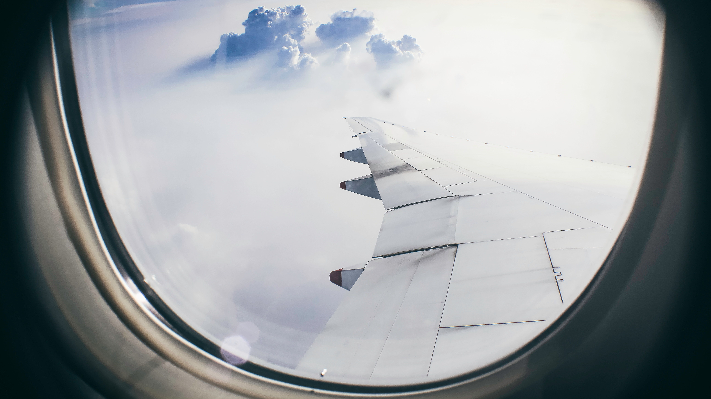

At the end of March, I had the opportunity to speak at [JazzCon](https://jazzcon.tech/) in New Orleans. It was an incredible conference. I'm fairly new to conference speaking (this was only my second time) and JazzCon was the first time I'd had to travel to speak. There were quite a few things I learned so I collected them here. I hope you find them helpful. Here we go.

**Book travel early**

I learned this one the hard way. Due to multiple factors, I didn't book my travel until about 3 weeks from the start of the conference. Prices almost doubled 🤮. I was not happy and neither was my wallet. Don't do what I did. Book your travel accomodations as early as you can.

Pro Tip: My favorite app for finding inexpensive flights is [Hopper](https://www.hopper.com/). It's saved me $1,000+ in the year I've used it and I don't fly that often.

**Look for hotel alternatives**

I'm a big fan of AirBnB. I know some who have had bad experiences, but mine have always been stellar. Check to see if AirBnB (or other simlar services) have any available options near your conference venue. You may be surprised by what you find. I used AirBnB and was able to book a full apartment for less than a hotel room.

**Stay close to the venue**

Many times, you'll find that the conference organizers recommend a hotel. Not only can this come with a discount, but you're also guaranteed to be close to the conference venue. Not having a long commute to the conference in the morning (especially if you've enjoyed the night life the night prior 😁), being able to run back to your room if you forgot something, and dropping off your bag(s) each evening before going out are all reasons to stay close. Keep this in mind especially if you decide to look for hotel alternatives.

**Finish slides _before_ going**

Everyone has a different approach to preparing talks. Some have their slides finished weeks ahead of time while others put them together the night before. While I tend to default to the latter, I've found I feel more prepared and give a better talk when I stick with the former. When travelling, I found it even more evident that I needed to get my slides done early. For JazzCon, I wasn't able to spend as much time with people as I would have liked because I was stuck in my room finishing up my presentation.

**Spend time with the other speakers/attendees**

Fair warning, I'm an extrovert. For all my introverts out there, this may be a little more taxing, espeically after a full day of being around/speaking with people, so your mileage may vary. I will simply say that the people I met and the friends I reconnected with made the conference worth going to. [After all, code is ephemeral. People are not.](https://twitter.com/jennschiffer/status/600109116019838976)

**Get food recommendations from locals**

I love food. As do most people I meet. There will almost certainly be some speakers and attendees at the conference who are from the local area. Pick their brains on the best places to eat. A group of us at JazzCon did this and were blessed with [Mother's](http://www.mothersrestaurant.net/) (which was delicious!).

**Enjoy the destination**

Each city has its own personality. I found it invigoration walking the streets of New Orleans in the evening and hearing so much music. Discover the city your in. Take in the sites, sounds, smells. This will be a little more difficult if you don't have your slides finished before going 😉. Assuming you do, however, there are typically opportunities to go out each night after the conference and some activities might even be organized by the people running the conference. Enjoy them.

**Relax**

Travelling can be stressful. Speaking can be stressful. Mash those two together and it can make for quite the stress cocktail. Relax. Breathe. Be yourself, spend time with people, enjoy the time, and it will be alright.

---

Anything I missed? Any other lessons you've learned traveling? Share them with me on [Twitter](https://twitter.com/RayGesualdo) and I'll add them here (with attribution 😀).
