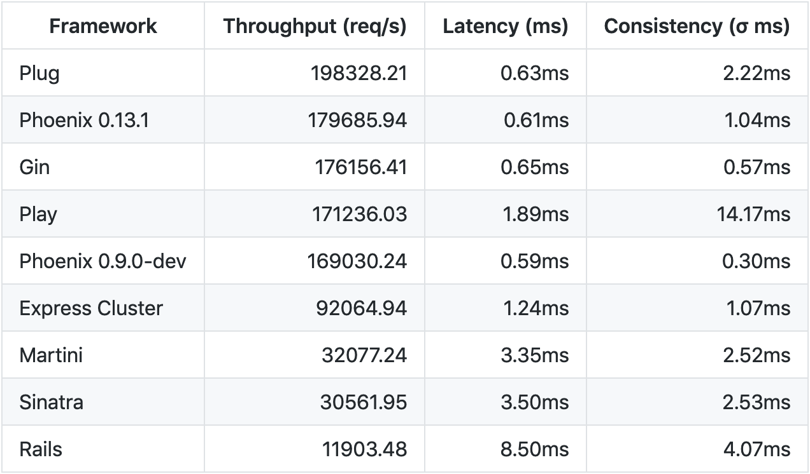

I've been thinking about Elixir quite a bit recently. At [SalesLoft](https://salesloft.com/), we're in the process of [breaking up a Ruby on Rails monolith into different microservices](https://medium.com/salesloft-engineering/monolith-to-microservice-without-downtime-a-production-story-652c9b82f03e). Some are written in Ruby, but a growing number of them are written in Elixir. This was my first exposure to the language and the more I experiment with it, the more I like it. I wrote a while back about [simulating Texas Hold'em in Elixir](/posts/2018/08/28/simulating-texas-holdem-in-elixir/) and I worked through the [2018 Advent of Code in Elixir](https://github.com/raygesualdo/advent-of-code-2018) as well. These have been my first forays using the language and I have plans for more robust applications in the near future. In the mean time, I wanted to share - specifically from a JavasScripter's perspective - why Elixir has captured my attention.

## What is this "Elixir" you speak of?

If you've never heard of Elixir, let me provide some background. Elixir is based on Erlang, a language that was originally created to run telecomm hardware. Because it runs on the Erlang VM, a.k.a. the _BEAM_, it gains all of Erlang's benefits including its resiliency, its concurrency model, and the fact it's been battle tested in production for over three decades. Elixir utilizes many functional programming paradigms as well including immutable data structures and applications being a series of data transformations (or _reductions_). Code is organized into modules, much like JavaScript. We'll delve into more specific aspects of Elixir in a bit.

TODO: flesh out content above

## Elixir. Elixir. Wherefore art thou, Elixir?

What I've found interesting is the complete lack of discussion about Elixir in the server-side JavaScript community (which I'll refer to as "JSC" from now on). In fact, I'd bet many of you never heard of Elixir before this blog post. I'm not 100% sure why Elixir is absent in many of the JSC's discussions, but I have my theories.

First, There's no generally accepted "one right way" to build a web application in JavaScript. Fill in the blank: "Rails is to Ruby as **\_\_\_\_** is to Node.js." There isn't anything to put there (and Express doesn't count). I don't find the JSC in the habit of seeking out full web application frameworks when approaching development. For better or worse, Elixir and its most popular web framework, Phoenix, have been branded as a Ruby on Rails alternative. While this is not wholly untrue, Elixir can do so much more than simply replace Ruby on Rails. But since the JSC hasn't been enamored with RoR to begin with, having a tool branded as a RoR alternative doesn't really attract attention.

Second, many JavaScripters are flocking to serverless paradigms. I myself tend to favor serverless options before running my own server for, well, just about anything. Elixir doesn't fit well within a serverless model. While it can be invoked like a scripting language, it expects to be runIt's interesting to note that Elixir does embody some serverless concepts in its architecture. But running an Elixir application still requires a server/VPS/container running somewhere.

Third, Elixir itself is a newer language. It's only been around since 2011. It's built on Erlang, which has been around for 30+ years, but its still not that popular itself. Elixir does appear to be growing in popularity so this may be less of an issue in a few years time.

Fourth, the Elixir programming model takes some getting used to. We have seemingly never-ending discussions in the JSC about object-oriented vs functional programming. Elixir has been described as "concurrent programming," a slightly different way to think through and approach building applications.

##

TODO: Expand content
With that background, let me share 11 reasons why Elixir should be considered by more JavaScripters:

1. **Great docs** 
   First, and I think this is incredibly important especially when delving into a new language, the docs for Elixir are fantastic! When I say "docs", I mean both the [language website](https://elixir-lang.org/) with tutorials as well as the [Elixir language API documentation](https://hexdocs.pm/elixir/api-reference.html). And the API documentation style is the same _across every Elixir project and published package_! Elixir provides a modules called `hexdocs` that packages all Elixir projects' documentation into the same website format. To borrow the phrase, "if you've seen one, you've seen them all" which is very reassuring when you're brand new to an ecosystem. That consistency has helped me on multiple occasions. I didn't realize how important it was until I had to go back and pull up the doc site for a new JavaScript library I was trying out.

2. **Erlang underpinnings** 
   I mentioned earlier that Elixir is built on Erlang. This is a vital aspect of Elixir's resiliency, concurrency, and performance story. Joe Armstrong, a co-creator of Erlang, recently mentioned in an [interview](https://www.erlang-solutions.com/blog/let-s-talkconcurrency-with-joe-armstrong.html) that the goal of Erlang was to be extremely fault-tolerant first and foremost. Concurrency and performance were secondary, but no less important, concerns. Erlang has been used in telecomm switches for the better part of three decades. In fact, [90% of all internet traffic goes through Erlang controlled nodes](https://twitter.com/francescoc/status/1002496512721588225?lang=en).

3. **Serverless model with processes** 
   Elixir has a fascinating process model (inherited from Erlang) that allows it to run

4. **Concurrency** 
   Speaking of concurrency, that is another area Elixir excels. Take a web server written using the Phoenix framework for example (we'll talk more about Phoenix in just a moment). In a 2015 blog post, the Phoenix team was able to get 2 million websocket connections connected concurrently to a single server. That's the entire population of New Mexico connected simultaneously. To a single physical server. The article even ends with the fact that they did very little to optimize the websocket handlers specifically. A little more work and that number could have gone up further. That post was over 3 years go too. Elixir has gotten even more performant since then.

5. **Standard Library** 
   The standard library in Elixir is incredibly robust. I discovered much of this when I was working through Advent of Code. There's so much functionality, especially the [Enum module](https://hexdocs.pm/elixir/Enum.html) for working with enumerable collections. When I switched back to JavaScript, I always found myself wishing there was a better collection of standard functions readily available.

6. **Speed** 
   It's fast. Like, really fast! API response times sometimes show up in the _microseconds_. It can duke it out with the best web frameworks across languages.

   

   <small>Sourced from [Comparative Benchmark Numbers @ Rackspace](https://gist.github.com/omnibs/e5e72b31e6bd25caf39a)</small>

7. **Scripting** 
   Much like JavaScript, you can use Elixir as a scripting language. Meaning, you can write a free-standing Elixir file and run it directly. I don't see tons of people doing this, but it's good to know it can be done. I recently wrote a podcast generator entirely as an Elixir script. Interestingly, Elixir tests are written this way as well.

8. **Phoenix** 
   Phoenix is the de facto web application framework in Elixir. It was created by Chris McCord and José Valim (co-creator of Elixir and long-time Rubyist). It provides a full toolset for creating web applications much like Rails does in the Ruby community.

9. **Functional-lite** 
   I say "functional-lite" because, while Elixir does embrace many of the best aspects of functional programming such as immutable data structures and stateless data transformation, you won't find any talk of monads or monoids here. To me, this is a plus and one of the reasons it's been difficult for me to get into Haskell. I don't want to have to learn significant aspects of category theory to build a web application. I'm not bashing heavy FP languages like Haskell. I still want to learn at least one before I retire. But in terms of accessibility and usability, Elixir strikes the right balance for me by...

10. **Mix** 
    Mix is like NPM on steroids. It's a CLI tool included with Elixir that provides dependency management alongside a host of other functionality, including project and file scaffolding, documentation generation, test running, code profiling, and release creation. It's also highly extensible. Installed modules can easily add commands to mix, otherwise known as mix "tasks". Phoenix adds quite a few mix tasks including new project generators and database management tasks. Adding your own in a project is easy as well. A single file with the correct naming convention and you're off to the races. I did this during Advent of Code when I wanted to [start working on the new day's problem](https://github.com/raygesualdo/advent-of-code-2018/blob/master/lib/mix/tasks/new_day.ex). I also unashamedly commandeered my coworker [Ben's mix task](https://github.com/sionide21/Advent-of-Code-2018/blob/master/lib/mix/tasks/solve.ex) for [solving each day's problem](https://github.com/raygesualdo/advent-of-code-2018/blob/master/lib/mix/tasks/solve.ex).

11. **Meta programming** 
    This one may hurt your brain the first time you try it. It hurt mine a bit. Elixir has a highly flexible meta programming model. What do I mean by this? In Elixir, code can be thought of as data describing the instructions we want to be executed. If our code is data, we can manipulate that data to do various things. This meta programming characteristic allow us to create DSLs and macros such as [Absinthe's schema creation DSL](https://hexdocs.pm/absinthe/schemas.html) for defining GraphQL schemas in code. I only started working with this concept and it seems incredibly powerful. I don't think creating macros is necessary in everyday Elixir use, but I've seen it helpful when creating libraries or tackling a very specific problem space.

I hope these points have inspired you to delve further into Elixir, especially if you are JavaScripter at heart.

---

Have thoughts on Elixir? Chat with me about them on [Twitter](https://twitter.com/RayGesualdo)!
